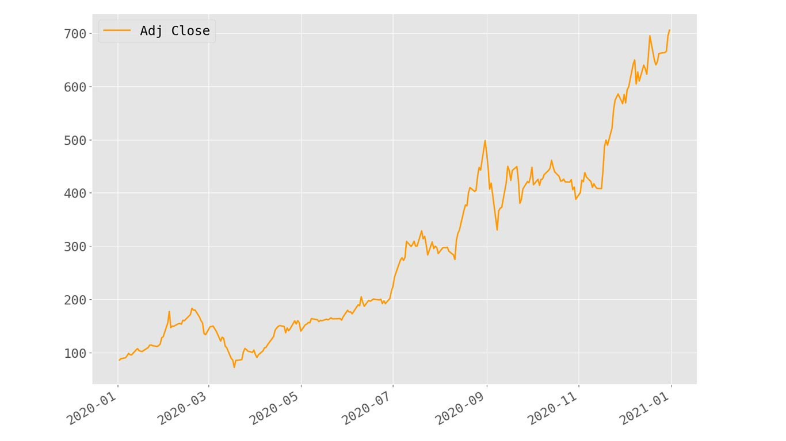
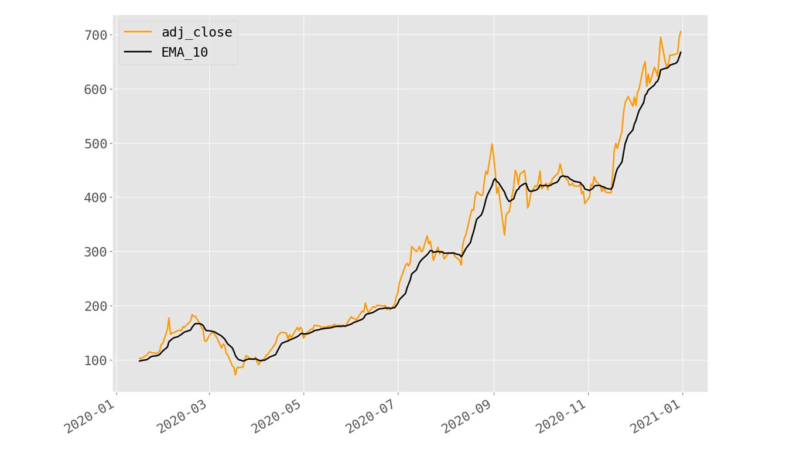
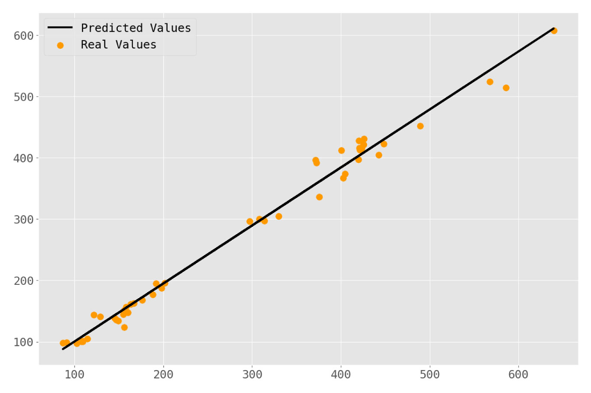
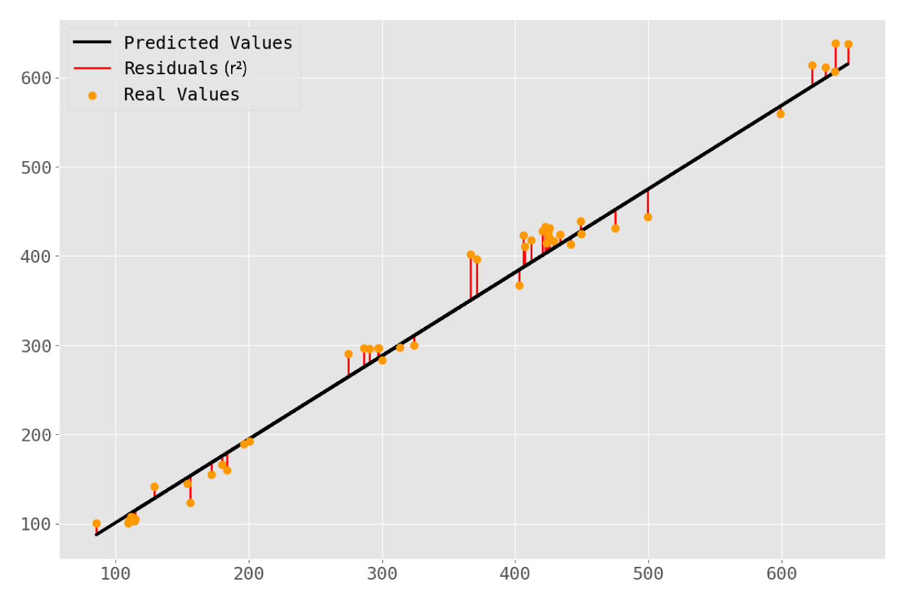

# Stock Market Price Prediction Using Linear Regression

## Introduction 

Linear regression is utilized in business, science, and just about any other field where predictions and forecasting are relevant. It helps identify the relationships between a dependent variable and one or more independent variables. Simple linear regression is defined by using a feature to predict an outcome. That’s what we’ll be doing here.
Stock market forecasting is an attractive application of linear regression. Modern machine learning packages like scikit-learn make implementing these analyses possible in a few lines of code.

## STEP 1 :- GET DATA 
Before starting any project there is need of collecting the data .Here we are using Tesla Motors DataSet . I took these data from finance.yahoo.com and loading it into memory as a pandas data  frame.

# List of entries

            Date        Open        High  ...       Close   Adj Close     Volume
    0    2020-01-02   84.900002   86.139999  ...   86.052002   86.052002   47660500
    1    2020-01-03   88.099998   90.800003  ...   88.601997   88.601997   88892500
    2    2020-01-06   88.094002   90.311996  ...   90.307999   90.307999   50665000
    3    2020-01-07   92.279999   94.325996  ...   93.811996   93.811996   89410500
    4    2020-01-08   94.739998   99.697998  ...   98.428001   98.428001  155721500
    ..          ...         ...         ...  ...         ...         ...        ...
    248  2020-12-24  642.989990  666.090027  ...  661.770020  661.770020   22865600
    249  2020-12-28  674.510010  681.400024  ...  663.690002  663.690002   32278600
    250  2020-12-29  661.000000  669.900024  ...  665.989990  665.989990   22910800
    251  2020-12-30  672.000000  696.599976  ...  694.780029  694.780029   42846000
    252  2020-12-31  699.989990  718.719971  ...  705.669983  705.669983   49649900
    [253 rows x 7 columns]
    # Show some summary statistics
    print(df.describe())
                Open        High         Low       Close   Adj Close        Volume
    count  253.000000  253.000000  253.000000  253.000000  253.000000  2.530000e+02
    mean   289.108428  297.288412  280.697937  289.997067  289.997067  7.530795e+07
    std    167.665389  171.702889  163.350196  168.995613  168.995613  4.013706e+07
    min     74.940002   80.972000   70.101997   72.244003   72.244003  1.735770e+07
    25%    148.367996  154.990005  143.222000  149.792007  149.792007  4.713450e+07
    50%    244.296005  245.600006  237.119995  241.731995  241.731995  7.025550e+07
    75%    421.390015  430.500000  410.579987  421.200012  421.200012  9.454550e+07
    max    699.989990  718.719971  691.119995  705.669983  705.669983  3.046940e+08

## STEP-2 Prepare the data
Before we start developing our regression model we are going to trim our data some. The ‘Date’ column will be converted to a DatetimeIndex and the ‘Adj Close’ will be the only numerical values we keep. Everything else is getting dropped.

                Adj Close
    Date                  
    2020-01-02   86.052002
    2020-01-03   88.601997
    2020-01-06   90.307999
    2020-01-07   93.811996
    2020-01-08   98.428001
    ...                ...
    2020-12-24  661.770020
    2020-12-28  663.690002
    2020-12-29  665.989990
    2020-12-30  694.780029
    2020-12-31  705.669983

    [253 rows x 1 columns]

**Output of line 18**
    <class 'pandas.core.frame.DataFrame'>
    DatetimeIndex: 253 entries, 2020-01-02 to 2020-12-31
    Data columns (total 1 columns):
    #   Column     Non-Null Count  Dtype  
    ---  ------     --------------  -----  
    0   Adj Close  253 non-null    float64
    dtypes: float64(1)
    memory usage: 4.0 KB

What we see here is our ‘Date’ column having been converted to a DatetimeIndex with 253 entries and the ‘Adj Close’ column being the only retained value of type float64 (np.float64.) Let’s plot our data to get a visual picture of what we’ll be working with from here on out.

### Aside: Linear Regression Assumptions & Autocorrelation

Before we proceed we need to discuss a technical limitation of linear regression. Linear regression requires a series of assumptions to be made to be effective. One can certainly apply a linear model without validating these assumptions but useful insights are not likely to be had.

- One of these assumptions is that variables in the data are independent. Namely, this dictates that the residuals (difference between the predicted value and observed value) for any single variable aren’t related.

- For Time Series data this is often a problem since our observed values are longitudinal in nature—meaning they are observed values for the same thing, recorded in sequence. This produces a characteristic called autocorrelation which describes how a variable is somehow related to itself .

## STEP-3 :- Additing Technical Indicators

1. Technical indicators are calculated values describing movements in historic pricing data for securities like stocks, bonds, and ETFs. Investors use these metrics to predict the movements of stocks to best determine when to buy, sell, or hold.

2. Commonly used technical indicators include moving averages (SMA, EMA, MACD), the Relative Strength Index (RSI), Bollinger Bands (BBANDS), and several others. There is certainly no shortage of popular technical indicators out there to choose from. To add our technical indicators we’ll be using the pandas_ta library. To get started, let’s add an exponential moving average (EMA) to our data:

        # Inspect Data once again
                    adj_close      EMA_10
        date                              
        2020-01-02   86.052002         NaN
        2020-01-03   88.601997         NaN
        2020-01-06   90.307999         NaN
        2020-01-07   93.811996         NaN
        2020-01-08   98.428001         NaN
        ...                ...         ...
        2020-12-24  661.770020  643.572394
        2020-12-28  663.690002  647.230141
        2020-12-29  665.989990  650.641022
        2020-12-30  694.780029  658.666296
        2020-12-31  705.669983  667.212421
        [253 rows x 2 columns]
        <class 'pandas.core.frame.DataFrame'>
        DatetimeIndex: 253 entries, 2020-01-02 to 2020-12-31
        Data columns (total 2 columns):
        #   Column     Non-Null Count  Dtype  
        ---  ------     --------------  -----  
        0   adj_close  253 non-null    float64
        1   EMA_10     244 non-null    float64
        dtypes: float64(2)

As evident from the printouts above, we now have a new column in our data titled “EMA_10.” This is our newly-calculated value representing the exponential moving average calculated over a 10-day period.

Now we’re ready to start developing our regression model to see how effective the EMA is at predicting the price of the stock. First, let’s take a quick look at a plot of our data now to get an idea of how the EMA value tracks with the adjusted closing price.

We can see here the EMA tracks nicely and that we’ve only lost a littttttle bit of our data at the leading edge. Nothing to worry about—our linear model will still have ample data to train on!

## STEP-4 :- Test Train Split 
Machine learning models require at minimum two sets of data to be effective: the training data and the testing data. Given that new data can be hard to come by, a common approach to generate these subsets of data is to split a single dataset into multiple sets.

The 80/20 split is where we’ll be starting out. Rather than mucking about trying to split our DataFrame object manually we’ll just the scikit-learn test_train_split function to handle the heavy lifting:

**Test Data** 

            adj_close
    count     49.000000
    mean     272.418612
    std      140.741107
    min       86.040001
    25%      155.759995
    50%      205.009995
    75%      408.089996
    max      639.830017

**Train Set**

              adj_close
    count    194.000000
    mean     291.897732
    std      166.033359
    min       72.244003
    25%      155.819996
    50%      232.828995
    75%      421.770004
    max      705.669983

We can see that our data has been split into separate DataFrame objects with the nearest whole-number value of rows reflective of our 80/10 split (49 test samples, 192 training samples.) Note the test size 0.20 (20%) was specified as an argument to the train_test_split function.

## STEP-5 :- Training the model
We have our data and now we want to see how well it can be fit to a linear model. Scikit-learn’s LinearRegression class makes this simple enough—requiring only 2 lines of code (not including imports):

That’s it—our linear model has now been trained on 194 training samples. Now we can assess how well our model fits our data by examining our model coefficients and some statistics like the mean absolute error (MAE) and coefficient of determination (r2).

## STEP-6 :- Validating the Fit
The linear model generates coefficients for each feature during training and returns these values as an array. In our case, we have one feature that will be reflected by a single value. We can access this using the model.regr_ attribute.

    Model Coefficients: [[0.94540376]]
    Mean Absolute Error: 12.554147460577513
    Coefficient of Determination: 0.9875188616393644

The MAE is the arithmetic mean of the absolute errors of our model, calculated by summing the absolute difference between observed values of X and Y and dividing by the total number of observations.

For now, let’s just recognize that a lower MAE value is better, and the closer our coefficient of the correlation value is to 1.0 the better. The metrics here suggest that our model fits our data well, though the MAE is slightly high.

Let’s consider a chart of our observed values compared to the predicted values to see how this is represented visually:

This looks like a pretty good fit! Given our relatively high r2 value that’s no surprise. Just for kicks, let’s add some lines to represent the residuals for each predicted value.

This doesn’t tell us anything new but helps to conceptualize what the coefficient of correlation is actually representing—an aggregate statistic for how far off our predicted values are from the actual values. So now we have this linear model—but what is it telling us?

## STEP-7 :- Interpretation 
At this point, we’ve trained a model on historical pricing data using the Adjusted Closing value and the Exponential Moving Average for a 10-day trading period. Our goal was to develop a model that can use the EMA of any given day (dependent on pricing from the previous 9 days) and accurately predict that day’s closing price. Let’s run a simulation of a very simple trading strategy to assess how well we might have done using this.

Strategy: If our model predicts a higher closing value than the opening value we make a trade for a single share on that day—buying at market open and selling just before market close.

https://gist.github.com/Archies13Singh/43c42005a677de58f9fd73dc64367b6f

## Result 
In the 49 possible trade days, our strategy elected to make 4 total trades. This strategy makes two bold assumptions:

- We were able to purchase a share at the exact price recorded as the historic opening price;
- We were able to sell that share just before closing at the exact priced recorded as the historic closing price.

Applying this strategy—and these assumptions—our model generated $151.77(₹11322.77). If our starting capital was $1,000(₹74600) this strategy would have resulted in a ~15.18% increase of total capital.